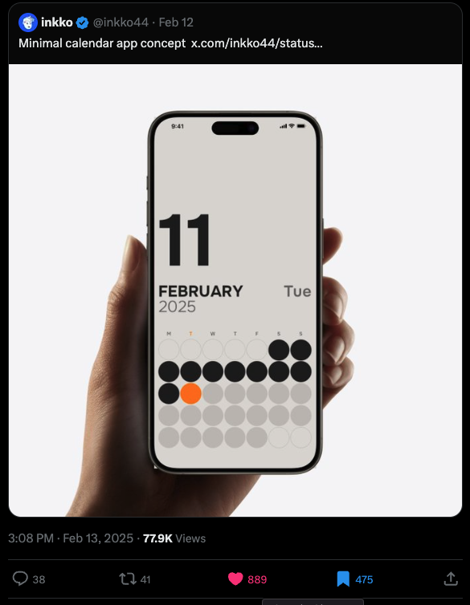

# 🗓️ [Calmendar](https://calmendar.web.app) - A Clean & Minimal Calendar UI

## 🌟 Introduction
Live Site: [calmendar.web.app](https://calmendar.web.app)

I was scrolling through Twitter and came across a beautiful **clean and modern calendar UI design** by [@inkko44](https://x.com/inkko44/status/1889889273190760459). The design really stood out to me with its simplicity and calm aesthetic, so I decided to **recreate it in Flutter**.

## 🎨 Design Inspiration




- The original UI design looked minimalistic and elegant.
- I wasn't sure about the exact fonts used, so I decided to use **Inter (Google Fonts)**, which fits the clean and modern look perfectly.
- Added an extra feature: **customizable color themes**, so users can switch between different color schemes.

## 📱 Platforms Supported

- The app is **fully responsive** and works great on **mobile (Android/iOS) and web**.
- Currently, it is **only deployed for web**, as the goal of this project is to **showcase my Flutter UI and design skills** rather than build a production-ready app.
- You can check out the **[web app here](https://calmendar.web.app/)**

## 🚀 Features

✅ **Clean & Minimal UI** - Inspired by modern design trends.  
✅ **Fully Responsive** - Works seamlessly across devices.  
✅ **Theme Customization** - Pick different colors for a personalized look.  
✅ **Smooth Animations** - Hover effects, smooth transitions, and a pleasant user experience.  
✅ **Flutter Web Support** - No need to install an app; just visit the link and try it.  

## 🎥 Demo

 

https://github.com/user-attachments/assets/dbebb6a4-e847-4f0c-84dd-463f07a14158


<!-- 🔗 Watch the full **demo video** here: [INSERT_DEMO_VIDEO_LINK_HERE]   -->

## 🛠️ Tech Stack

- **Flutter** (for UI & responsiveness)
- **Flutter Riverpod** (state management)
- **Google Fonts** (Onest)
- **`flutter_animate`** (animations)
- **`dotted_border`** (for dotted border)

## 📂 Installation & Running Locally

If you want to run this project locally:

```sh
# Clone the repository
git clone https://github.com/0xharkirat/calmendar.git
cd calmendar

# Install dependencies
flutter pub get

# Run the project
flutter run -d chrome
```

## 📝 Conclusion

I know there are **millions of calendar apps** out there, but I just loved the **clean and calm UI** of this one, so I built it as a **Flutter UI challenge**. Hope you like it! 😊

Let me know what you think! Feel free to contribute or suggest improvements. 🚀

